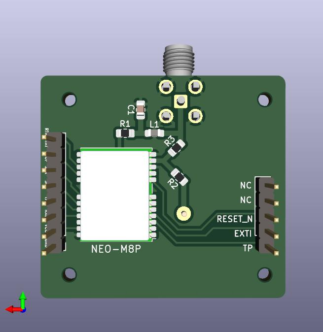

# ublox NEO-M8P GPS Board design

The board serves an SMA connector for an external active antenna and a slot for a passive ceramic patch antenna 25x25 mm.

## Schematics

[schematics.pdf](schematics.pdf)

## 3D rendered

<table style="width:100%">
	<tr>
		<th>Top view</th>
		<th>Bottom view</th>
	<tr>
    <tr>
        <td>
            
        </td>
        <td>
            
        </td>
    </tr>
</table>

## PCB layout

## Gerber files

See the [gerbers](gerbers) folder.

## Revisions

### V2

SMA active antenna only.

